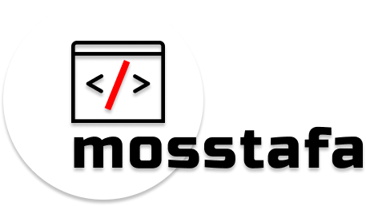

Mosstafa is a simple GUI for Moss.   [What is Moss ?](https://theory.stanford.edu/~aiken/moss/)

### How to use it 
* Download latest version from Releases
* Start application
* Enter UserID and preferred language
    * Supported language ``` "c",
        "cc",
        "java",
        "ml",
        "pascal",
        "ada",
        "lisp",
        "scheme",
        "haskell",
        "fortran",
        "ascii",
        "vhdl",
        "verilog",
        "perl",
        "matlab",
        "python",
        "mips",
        "prolog",
        "spice",
        "vb",
        "csharp",
        "modula2",
        "a8086",
        "javascript",
        "plsql" ``` 
* Add Base file and test directories
* Generate report

### How Mosstafa works

Mosstafa behind GUI uses awesome [Mosspy](https://github.com/soachishti/moss.py) script for communicating with Moss server.

### For development environment

Clone repository in desired directory
```sh
git clone git@github.com:ferit-racunarstvo/mosstafa.git
``` 
Then do the following commands
```sh
python -m venv venv
source venv/bin/activate
pip install -r requirements.txt 
``` 
To start application
```sh
python main.py
``` 

### Python compatibility
Python v3.9.0 >=

### FAQ

##### 1. How can i get my User ID ?
Follow this [link](https://theory.stanford.edu/~aiken/moss/). Find "Registering for Moss" section.

License
----

MIT